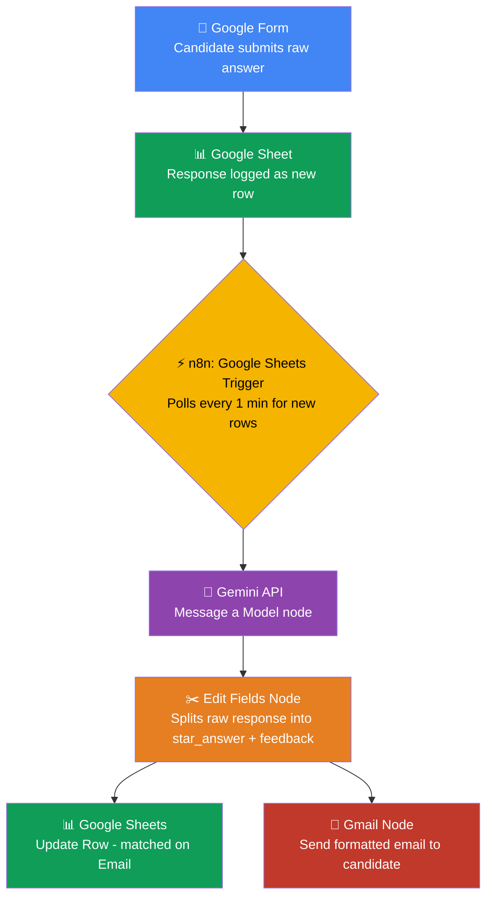
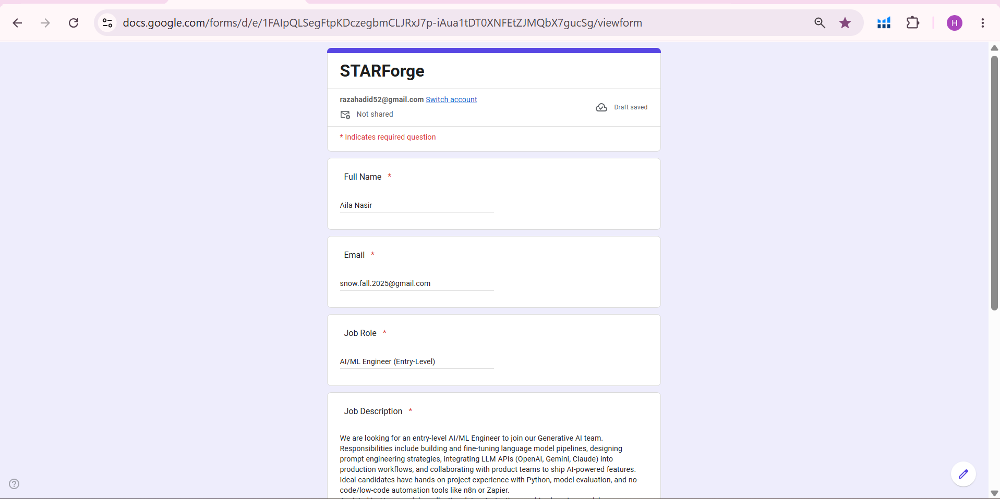
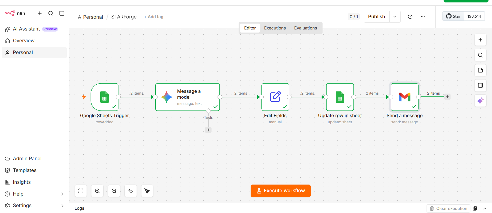
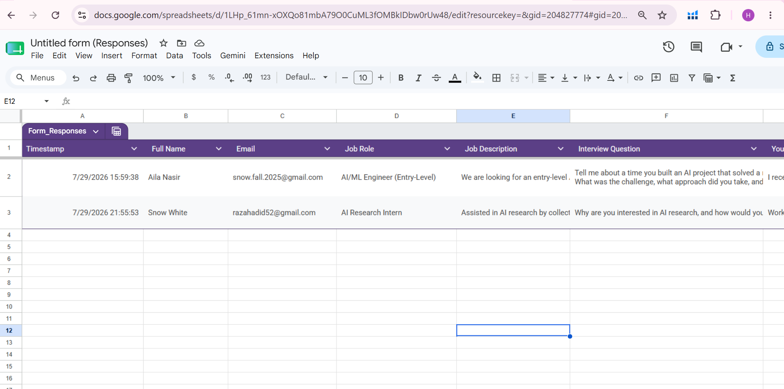
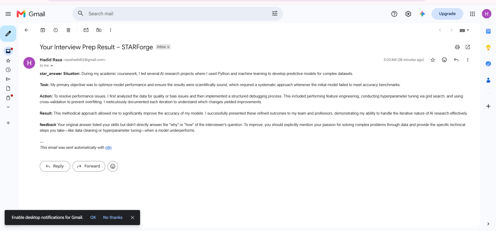
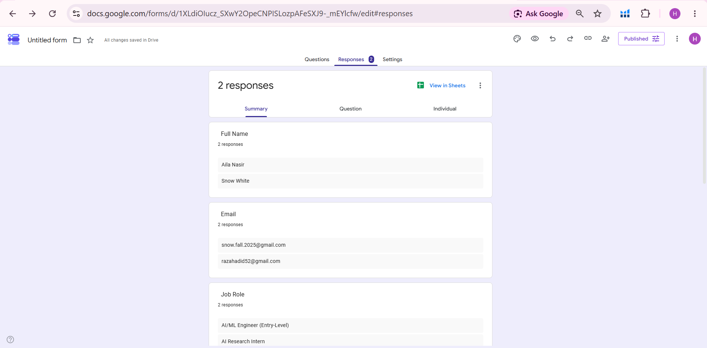

# 🎯 STARForge — AI-Powered Interview Answer Triage

> An autonomous no-code pipeline that converts a candidate's raw, unstructured interview answer into a polished STAR-format response and actionable feedback — delivered straight to their inbox, with zero human intervention.

**Week 5 · Generative AI & Prompt Engineering Internship · NeuroFive Solutions**

---

## 📌 Table of Contents

- [The Problem](#-the-problem)
- [The Solution](#-the-solution)
- [Architecture](#-architecture)
- [Tech Stack](#-tech-stack)
- [Workflow Breakdown](#-workflow-breakdown-node-by-node)
- [Prompt Design](#-prompt-design)
- [Challenges & Fixes](#-challenges--fixes)
- [Testing](#-testing)
- [Sample Output](#-sample-output)
- [What I'd Add Next](#-what-id-add-next)
- [Demo](#-demo)
- [About Me](#-about-me)

---

## 🧩 The Problem

Every candidate has a good story. Most just can't structure it under pressure.

A strong project sitting in someone's memory often comes out in an interview flat and unstructured — no clear situation, no measurable result, no narrative arc. Career coaches solve this by manually rewriting answers into the **STAR framework** (Situation, Task, Action, Result) — but that doesn't scale. One coach can review a handful of candidates a day; a real hiring pipeline needs hundreds.

**The question driving this build:** can an AI agent do this reframing in real time, at zero marginal cost per candidate, without a human coach in the loop?

## 💡 The Solution

**STARForge** is a fully automated, no-code pipeline that:

| Step | What Happens |
|---|---|
| 1 | Candidate submits their raw interview answer through a simple Google Form |
| 2 | Response is logged to a Google Sheet in real time |
| 3 | n8n detects the new row and triggers the workflow instantly |
| 4 | Gemini API rewrites the answer in STAR format **and** generates specific feedback |
| 5 | The result is parsed, written back to the Sheet, and emailed to the candidate — all in under 20 seconds |

No developer, no manual review, no delay between submission and delivery.

---

## 🏗 Architecture

### Data Flow at a Glance

[Full Name, Email, Job Role, Job Description, Interview Question, Raw Answer]
│
▼
Gemini receives structured context
│
▼
Returns: star_answer (HTML) + feedback (HTML)
│
┌─────────────┴─────────────┐
▼ ▼
Sheet row updated Email sent to candidate
(STAR_Answer, Feedback cols) (formatted, bold headings)

---

## ⚙️ Tech Stack

| Component | Tool | Why |
|---|---|---|
| Orchestration | **n8n** (self-hosted) | No-code visual workflow builder, free tier, full control over node logic |
| Data capture | **Google Forms + Sheets** | Zero-friction intake, acts as both database and audit log |
| AI Model | **Google Gemini API** (`gemini-3-flash-preview`) | Fast inference, strong instruction-following for structured output |
| Delivery | **Gmail node (n8n)** | Native OAuth integration, no third-party SMTP needed |
| Prompt format | **HTML output** | Forces clean rendering in email clients instead of raw Markdown |

---

## 🔍 Workflow Breakdown (Node-by-Node)

### 1️⃣ Google Sheets Trigger
- **Type:** `On Row Added`
- **Polling interval:** 1 minute
- **Watches:** `Form Responses 1` sheet tab

### 2️⃣ Gemini — Message a Model
- **Operation:** Message a Model
- **Model:** `gemini-3-flash-preview`
- **Input fields pulled:** Job Role, Job Description, Interview Question, Your Relevant Experience
- **Output requested:** two labeled sections — `star_answer` and `feedback`, formatted in clean HTML (`<b>`, ` `) instead of Markdown

### 3️⃣ Edit Fields (Set)
- Splits Gemini's single text block into two clean, independently usable fields:
  - `star_answer` → everything before the `### 2.` marker
  - `feedback` → everything after it

### 4️⃣ Google Sheets — Update Row
- **Matching column:** `Email` (unique per submission)
- **Columns written:** `STAR_Answer`, `Feedback`
- All other original form fields are left untouched

### 5️⃣ Gmail — Send a Message
- **To:** candidate's submitted email (mapped directly from the trigger data)
- **Subject:** `Your Interview Prep Result – STARForge`
- **Body:** HTML email containing both the STAR answer and feedback

---

## 🧠 Prompt Design

The core prompt sent to Gemini:

You are an interview coach. Below are the candidate's details.

Job Role: {{ Job Role }}
Job Description: {{ Job Description }}
Interview Question: {{ Interview Question }}
Candidate's Answer: {{ Your Relevant Experience }}

Return two things:

star_answer: rewrite the candidate's answer in STAR format
(Situation, Task, Action, Result), clear and concise
feedback: 2-3 lines of constructive feedback — what was good,
what could be improved

Format your entire response in clean HTML only. Use <b> tags for
bold headings,    for paragraph breaks. Do NOT use Markdown
syntax like ** or * anywhere in your response.

**Design decisions:**
- Explicit numbered output structure (`1.` / `2.`) makes downstream parsing deterministic
- HTML-only instruction was added *after* the first test run showed Gemini defaulting to Markdown, which rendered as raw asterisks in Gmail
- Feeding the full job context (not just the question) noticeably improved answer relevance — early tests without Job Description produced generic STAR answers disconnected from the actual role

---

## 🛠 Challenges & Fixes

| # | Problem | Root Cause | Fix |
|---|---|---|---|
| 1 | Fields returned `[undefined]` in the prompt | Manually typed expressions (`{{ $json['Job Role'] }}`) had hidden whitespace mismatches against the actual key names | Switched to drag-and-drop field insertion, which auto-generates exact-match expressions |
| 2 | Two field values landed in the same prompt line | Drag-drop cursor position wasn't reset between fields | Manually separated overlapping expressions and re-dropped each field into its own line |
| 3 | Email showed raw `**bold**` asterisks instead of formatted text | Gemini defaulted to Markdown; Gmail's HTML renderer doesn't interpret Markdown syntax | Added an explicit instruction forcing HTML tags (`<b>`, ` `) in the prompt |
| 4 | Cross-node reference (`$('NodeName').item.json.field`) returned `undefined` | Paired-item tracking broke after the data passed through multiple transformation nodes (Gemini → Edit Fields) | Dragged the field directly from the correct upstream node in the input panel instead of typing the reference manually |
| 5 | Google Sheets node couldn't find the correct spreadsheet from a search | Credential was linked to a different Google account than the one owning the sheet | Verified credential ownership and re-selected the document from the refreshed list |

---

## ✅ Testing

Tested end-to-end with **3 real form submissions** across different job roles and interview questions:

| Test # | Job Role | Result |
|---|---|---|
| 1 | AI/ML Engineer (Entry-Level) | ✅ Sheet updated, email delivered with correctly formatted STAR answer |
| 2 | AI Research Intern | ✅ Sheet updated, email delivered, feedback correctly tailored to academic research context |
| 3 | *(add your 3rd test here)* | ✅ |

Each run was verified at three checkpoints: **Sheet row update → email arrival → formatting correctness (no raw Markdown).**

---

## 📧 Sample Output

> **Situation:** During my 5-week Generative AI internship, our team needed to streamline the customer support process, which was bogged down by manual data entry and inconsistent response quality across multiple platforms.
>
> **Task:** My goal was to build an automated system that could ingest support tickets, categorize them accurately, and generate high-quality draft responses using LLMs to reduce the manual workload for the support staff.
>
> **Action:** I designed a multi-agent "Writer+Editor" pipeline using the Gemini API. I used n8n to build a no-code workflow connecting Google Forms to the AI engine...
>
> **Result:** The automation successfully reduced manual triage time by approximately 60%, achieving 100% data consistency in the backend database.
>
> **Feedback:** You have an impressive range of technical projects that perfectly align with the job description. What could be improved: your original answer was a "laundry list" of projects — in an interview, it's better to pick one high-impact project and explain it in depth.

---

## 📸 Screenshots

| Trigger & Data Capture | Workflow Execution |
|---|---|
|  |  |

| Sheet Auto-Updated | Email Delivered |
|---|---|
|  |  |

| Multiple Test Runs |
|---|
|  |
## 🚀 What I'd Add Next

- [ ] Error handling branch (IF node / Error Trigger) for failed API calls or empty submissions
- [ ] Input validation directly on the Google Form
- [ ] Rate-limit-aware batching for handling multiple simultaneous candidates
- [ ] A lightweight dashboard to review all past STAR answers in one place

---

## 🎥 Demo

📹 *[Video walkthrough — link added after upload]*

---

## 👩‍💻 About Me

**Aila Nasir** — Final-year CS student, aspiring AI/ML Engineer with a Generative AI focus.

🔗 [LinkedIn](https://www.linkedin.com/in/aila-nasir/) 
· [GitHub](https://github.com/ailanasirai) 
· [Kaggle](https://kaggle.com/ailanasirai)

---

*Built as part of the Generative AI & Prompt Engineering Internship at NeuroFive Solutions.*

